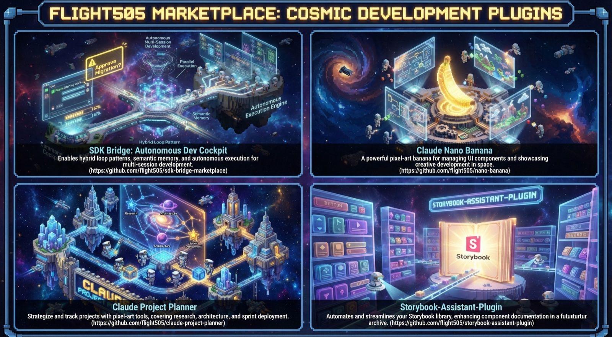
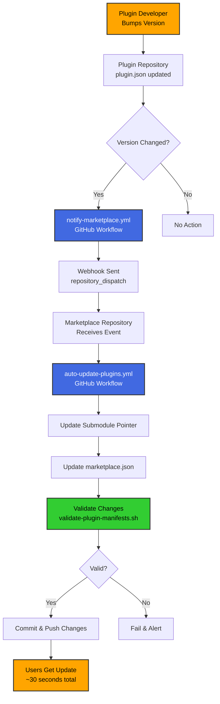

# flight505 Plugin Marketplace

[](https://github.com/flight505/flight505-marketplace/actions/workflows/auto-update-plugins.yml)
[](https://github.com/flight505/flight505-marketplace/actions/workflows/validate-plugin-manifests.yml)
[](https://github.com/flight505/flight505-marketplace)
[](https://github.com/flight505/flight505-marketplace)
[](LICENSE)

### Plugin Versions

[](https://github.com/flight505/sdk-bridge)
[](https://github.com/flight505/storybook-assistant)
[](https://github.com/flight505/claude-project-planner)
[](https://github.com/flight505/nano-banana)
[](https://github.com/flight505/taskplex)

**Official Claude Code plugin marketplace by Jesper Vang**

A centralized source for installing and automatically updating 5 professional Claude Code plugins with a single command.

> 🚀 **Real-time updates!** Plugin versions sync automatically within 30 seconds when new versions are released.

---

## 🎯 What This Marketplace Does (ELI5)

Think of this marketplace as an **app store for Claude Code plugins**. Instead of manually downloading and updating each plugin from different places, you add this marketplace once, and it handles everything automatically.

**What makes it special:**

1. **Install all plugins with one command** - No need to visit 4 different repositories
2. **Automatic updates** - When plugin authors release new versions, your marketplace syncs automatically (usually within 30 seconds)
3. **Quality assurance** - All plugins are validated before release to ensure they work correctly
4. **Maintenance scripts** - Behind the scenes, automated scripts keep everything in sync

**In simple terms:** You install this marketplace once, and your plugins stay up-to-date automatically. It's like having an app store that updates your apps in the background.

---

## 📦 Available Plugins

<details open>
<summary><b>🚀 SDK Bridge</b> - Autonomous development assistant</summary>

**What it does:** Interactive autonomous development assistant that generates PRDs, converts to execution format, and runs fresh Claude instances until all work is complete.

**Key features:**
- Interactive wizard with 7-checkpoint workflow
- PRD generation with smart story decomposition
- Configurable iteration timeouts and model selection
- Already-implemented detection (skips completed work)
- Robust process management with trap-based cleanup

**Repository**: [sdk-bridge](https://github.com/flight505/sdk-bridge)
**Documentation**: [README](https://github.com/flight505/sdk-bridge#readme)

</details>

<details>
<summary><b>🔧 TaskPlex</b> - Next-generation autonomous development</summary>

**What it does:** Resilient autonomous development with dependency-aware task execution, custom subagents, error categorization, and branch lifecycle management. Successor to SDK Bridge.

**Key features:**
- Custom subagents (implementer, validator, reviewer, merger)
- Error categorization with intelligent retry/skip
- Dependency-aware task selection
- Branch lifecycle management (create, commit, merge)
- Quality gate hooks (block destructive commands)
- Structured completion reports

**Repository**: [taskplex](https://github.com/flight505/taskplex)
**Documentation**: [README](https://github.com/flight505/taskplex#readme)

</details>

<details>
<summary><b>🎨 Storybook Assistant</b> - Complete Storybook 10 development toolkit</summary>

**What it does:** Helps you build and maintain React component libraries using Storybook, with AI-powered design-to-code transformation.

**Key features:**
- Vision AI design-to-code transformation
- Natural language component generation
- AI-powered accessibility remediation (WCAG 2.2)
- React 19 & Next.js 15 support
- Dark mode auto-generation
- Visual regression testing

**Repository**: [storybook-assistant](https://github.com/flight505/storybook-assistant)
**Documentation**: [README](https://github.com/flight505/storybook-assistant#readme)

</details>

<details>
<summary><b>📋 Claude Project Planner</b> - AI-powered project planning assistant</summary>

**What it does:** Production-ready project planning with progress tracking, error recovery, and comprehensive research.

**Key features:**
- Architecture research and building blocks
- Sprint planning with INVEST criteria
- Service cost analysis and ROI projections
- Risk assessment and mitigation strategies
- Report generation (PDF/DOCX/MD)

**Repository**: [claude-project-planner](https://github.com/flight505/claude-project-planner)
**Documentation**: [README](https://github.com/flight505/claude-project-planner#readme)

</details>

<details>
<summary><b>🍌 Nano Banana</b> - AI image and diagram generation</summary>

**What it does:** Generates high-quality images and technical diagrams using state-of-the-art AI models.

**Key features:**
- State-of-the-art image generation (Gemini 3 Pro, FLUX)
- Technical diagram creation with quality review
- Mermaid diagram support
- Smart iteration and optimization
- Powered by OpenRouter

**Repository**: [nano-banana](https://github.com/flight505/nano-banana)
**Documentation**: [README](https://github.com/flight505/nano-banana#readme)

</details>

---

## 🚀 Installation

### Quick Install (Recommended)

Install the marketplace and all 5 plugins with these commands:

```bash
# Start Claude Code
claude

# Add the marketplace
/plugin marketplace add flight505/flight505-marketplace

# Install all plugins
/plugin install sdk-bridge@flight505-plugins
/plugin install taskplex@flight505-plugins
/plugin install storybook-assistant@flight505-plugins
/plugin install claude-project-planner@flight505-plugins
/plugin install nano-banana@flight505-plugins
```

That's it! The marketplace will now keep all plugins updated automatically.

<details>
<summary><b>Alternative Installation Methods</b></summary>

### Manual Clone (Advanced)

```bash
# Clone the marketplace with all submodules
git clone --recurse-submodules https://github.com/flight505/flight505-marketplace.git ~/.claude/plugins/marketplaces/flight505-plugins

# Claude Code will auto-discover and install all plugins
claude
```

### Install Individual Plugins Only

```bash
claude

# Add marketplace first
/plugin marketplace add flight505/flight505-marketplace

# Then install only the plugins you want
/plugin install sdk-bridge@flight505-plugins
```

</details>

---

## 🔄 How Automatic Updates Work

This marketplace uses a sophisticated automation system to keep plugins updated. Here's what happens behind the scenes:



**What this means for you:**

1. **Fully Automated** - No manual work required once installed
2. **Fast** - Updates typically arrive within 30 seconds of release
3. **Reliable** - Daily backup checks ensure nothing is missed
4. **Safe** - All updates are validated before being published

### Manual Update (If Needed)

You can manually check for updates anytime:

```bash
claude

# Update specific plugin
/plugin update sdk-bridge@flight505-plugins

# Or update all plugins
/plugin update taskplex@flight505-plugins
/plugin update storybook-assistant@flight505-plugins
/plugin update claude-project-planner@flight505-plugins
/plugin update nano-banana@flight505-plugins
```

---

## 🛠️ Maintenance Scripts (For Developers)

If you're maintaining this marketplace or contributing, there are automated scripts that handle common tasks:

<details>
<summary><b>View Maintenance Scripts</b></summary>

### validate-plugin-manifests.sh

Checks that all plugin configuration files are correct and in sync.

```bash
# Check all plugins
./scripts/validate-plugin-manifests.sh

# Auto-fix common issues
./scripts/validate-plugin-manifests.sh --fix
```

**What it validates:**
- JSON syntax is correct
- Required fields are present
- Version numbers match between files
- File paths are correct
- Semantic versioning format

### bump-plugin-version.sh

Automates the entire process of releasing a new plugin version.

```bash
# Bump a plugin version
./scripts/bump-plugin-version.sh storybook-assistant 2.2.0

# Test what would happen (dry run)
./scripts/bump-plugin-version.sh sdk-bridge 3.0.0 --dry-run
```

**What it does automatically:**
1. Updates plugin.json version
2. Updates marketplace.json
3. Creates git commits in both repos
4. Pushes to GitHub
5. Creates version tags
6. Triggers webhook notification

### setup-webhooks.sh

Deploys webhook workflows to all plugin repositories.

```bash
./scripts/setup-webhooks.sh
```

**What it does:**
- Copies webhook workflow to each plugin
- Creates necessary directories
- Reports status for each operation

See [CLAUDE.md](CLAUDE.md) for detailed developer documentation.

</details>

---

## 🔍 Technical Deep Dive

<details>
<summary><b>How This Marketplace Works Under the Hood</b></summary>

### Architecture

This marketplace is built on **git submodules** and **GitHub Actions workflows**:

1. **Git Submodules** - Each plugin is a separate git repository included as a submodule
2. **marketplace.json** - Central configuration file listing all plugins and versions
3. **GitHub Actions Webhooks** - Automated pipelines that sync changes instantly
4. **Validation Scripts** - Quality checks that run before any update

### The Update Pipeline

When a plugin developer releases a new version, here's the complete flow:

**Step 1: Version Bump**
- Developer updates `.claude-plugin/plugin.json` with new version number
- Commits and pushes to plugin repository

**Step 2: Webhook Trigger**
- Plugin's `notify-marketplace.yml` workflow detects version change
- Sends `repository_dispatch` event to marketplace repository
- This happens automatically via GitHub Actions

**Step 3: Marketplace Update**
- Marketplace's `auto-update-plugins.yml` workflow receives event
- Updates git submodule pointer to latest plugin commit
- Updates `marketplace.json` with new version number
- Runs validation script to ensure everything is correct

**Step 4: Validation**
- `validate-plugin-manifests.sh` checks all configuration files
- Verifies version numbers match across all files
- Ensures all paths and references are valid
- Blocks update if any errors are found

**Step 5: Publish**
- If validation passes, changes are committed
- Pushed to main branch
- Users pulling the marketplace get the update

**Total Time:** Usually 20-30 seconds from version bump to availability

### Backup Systems

**Daily Cron Job**
- Runs at midnight UTC every day
- Checks all plugins for version mismatches
- Catches any updates that webhooks might have missed
- Ensures long-term reliability

**Manual Trigger**
- Marketplace maintainers can trigger updates manually
- Useful for troubleshooting or immediate updates
- Available via GitHub Actions web interface

### Version Synchronization

The system maintains version numbers in three places:

1. **Plugin's plugin.json** - Source of truth for plugin version
2. **marketplace.json** - Lists all plugin versions for Claude Code
3. **Git submodule pointer** - Points to specific plugin commit

All three must stay in sync. The automation and validation scripts ensure this happens automatically.

### Why Git Submodules?

Git submodules allow each plugin to:
- Have its own independent repository
- Be developed separately with its own history
- Be included in multiple marketplaces if desired
- Maintain a clear link between marketplace and specific plugin version

The downside is complexity, which is why we built automation scripts to handle it.

### Security & Quality

**Webhook Authentication**
- Uses GitHub Personal Access Tokens (PAT)
- Token stored as encrypted secret in GitHub
- Only authorized workflows can trigger updates

**Validation Gates**
- All updates must pass validation script
- Checks syntax, structure, and semantic versioning
- Prevents broken configurations from being published

**Manual Review Option**
- Maintainers can review updates before merging
- Automated PRs can be used instead of direct commits
- Provides extra safety for critical updates

</details>

---

## 📚 Documentation

- **For Users**: This README
- **For Plugin Developers**: [CLAUDE.md](CLAUDE.md) - Complete marketplace maintenance guide
- **For Contributors**: [CONTRIBUTING.md](CONTRIBUTING.md) (if you create this)

### Individual Plugin Documentation

Each plugin has comprehensive documentation in its repository:

- [SDK Bridge](https://github.com/flight505/sdk-bridge#readme) - Autonomous development assistant
- [TaskPlex](https://github.com/flight505/taskplex#readme) - Next-generation autonomous development
- [Storybook Assistant](https://github.com/flight505/storybook-assistant#readme) - Complete toolkit guide
- [Project Planner](https://github.com/flight505/claude-project-planner#readme) - Planning & tracking
- [Nano Banana](https://github.com/flight505/nano-banana#readme) - Image & diagram generation

---

## 🆘 Support & Contributing

### Getting Help

- **Plugin Issues**: Report at each plugin's GitHub repository (see links above)
- **Marketplace Issues**: [Create an issue here](https://github.com/flight505/flight505-marketplace/issues)
- **Discussions**: [GitHub Discussions](https://github.com/flight505/flight505-marketplace/discussions)

### Contributing

Contributions are welcome! If you'd like to:

- **Report a bug**: Open an issue with detailed information
- **Suggest a feature**: Start a discussion to gather feedback
- **Submit a plugin**: Ensure it follows the plugin standards in [CLAUDE.md](CLAUDE.md)
- **Improve documentation**: PRs are welcome for README or CLAUDE.md improvements

---

## 📄 License

This marketplace infrastructure is MIT licensed. Individual plugins may have different licenses:

- **sdk-bridge**: MIT License
- **taskplex**: MIT License
- **storybook-assistant**: MIT License
- **claude-project-planner**: MIT License
- **nano-banana**: MIT License

Check each plugin's repository for specific license details.

---

## 🔗 Links

- **This Marketplace**: https://github.com/flight505/flight505-marketplace
- **Author**: [@flight505](https://github.com/flight505) (Jesper Vang)
- **Plugin Repositories**:
  - [SDK Bridge](https://github.com/flight505/sdk-bridge)
  - [TaskPlex](https://github.com/flight505/taskplex)
  - [Storybook Assistant](https://github.com/flight505/storybook-assistant)
  - [Claude Project Planner](https://github.com/flight505/claude-project-planner)
  - [Nano Banana](https://github.com/flight505/nano-banana)

---

**Built with ❤️ by Jesper Vang**

**Powered by [Claude Code](https://claude.ai/download)** 🚀
