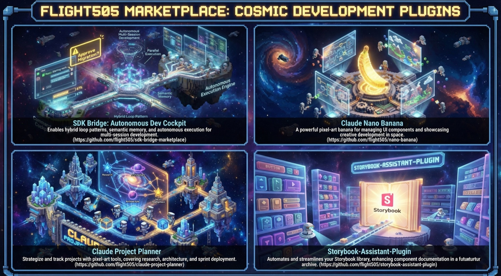

# flight505 Plugin Marketplace

[](https://github.com/flight505/flight505-marketplace/actions/workflows/auto-update-plugins.yml)
[](https://github.com/flight505/flight505-marketplace/actions/workflows/validate-plugin-manifests.yml)
[](https://github.com/flight505/flight505-marketplace)
[](https://github.com/flight505/flight505-marketplace)
[](LICENSE)

### Plugin Versions

[](https://github.com/flight505/sdk-bridge)
[](https://github.com/flight505/storybook-assistant)
[](https://github.com/flight505/claude-project-planner)
[](https://github.com/flight505/nano-banana)
[](https://github.com/flight505/ai-frontier)
[](https://github.com/flight505/autoresearch)
[](https://github.com/flight505/flight505-marketplace/tree/main/harness)

A centralized marketplace for 7 Claude Code plugins. Install the marketplace once, then pick the plugins you want. Updates sync automatically within ~30 seconds of a new release.

---

## Installation

### Step 1: Add the marketplace

From the Claude Code CLI (outside a session):

```bash
claude plugin marketplace add flight505/flight505-marketplace
```

### Step 2: Browse and install plugins

List available plugins from the marketplace:

```bash
claude plugin list --marketplace flight505-plugins
```

Install the plugins you want:

```bash
claude plugin install sdk-bridge@flight505-plugins
claude plugin install nano-banana@flight505-plugins
claude plugin install ai-frontier@flight505-plugins
# ... any combination you like
```

### Step 3: Enable auto-update (recommended)

```bash
claude plugin update --auto flight505-plugins
```

With auto-update enabled, plugins update automatically when you restart Claude Code. You can also manually update at any time:

```bash
claude plugin update flight505-plugins
```

### Direct install (without marketplace)

You can also install individual plugins directly from their repositories:

```bash
claude plugin install github:flight505/sdk-bridge
claude plugin install github:flight505/nano-banana
```

This works but you won't get the coordinated marketplace updates.

---

## Plugins

### SDK Bridge

PRD-driven autonomous development. Generates product requirement documents, decomposes them into user stories, and runs fresh Claude instances with quality gates until complete. Includes two-stage code review (spec compliance + code quality), TDD enforcement, and worktree-isolated execution per story.

**Commands:** `/sdk-bridge:start`, `/sdk-bridge:prd-generator`, `/sdk-bridge:prd-converter`

[Repository](https://github.com/flight505/sdk-bridge) · [Documentation](https://github.com/flight505/sdk-bridge#readme)

---

### Storybook Assistant

Complete Storybook development toolkit with Vision AI design-to-code transformation, natural language component generation, AI-powered accessibility remediation (WCAG 2.2), React 19 & Next.js 15 support, dark mode auto-generation, and visual regression testing.

[Repository](https://github.com/flight505/storybook-assistant) · [Documentation](https://github.com/flight505/storybook-assistant#readme)

---

### Claude Project Planner

Production-ready project planning with progress tracking and error recovery. Generates architecture docs, sprint plans with INVEST criteria, service cost analyses with ROI projections, risk assessments, and implementation roadmaps. Exports to PDF/DOCX/MD.

[Repository](https://github.com/flight505/claude-project-planner) · [Documentation](https://github.com/flight505/claude-project-planner#readme)

---

### Nano Banana

AI-powered image and diagram generation using state-of-the-art models (Gemini 3 Pro, FLUX) via OpenRouter. Creates technical diagrams, visual abstracts, and illustrations with quality review and smart iteration. Includes Mermaid diagram support.

**Commands:** `/nano-banana:edit`, `/nano-banana:visual-abstract`, `/nano-banana:setup`

[Repository](https://github.com/flight505/nano-banana) · [Documentation](https://github.com/flight505/nano-banana#readme)

---

### AI Frontier

Deep research intelligence — SOTA discovery, method analysis, and implementation guidance from arXiv, Semantic Scholar, Hugging Face Papers, and Perplexity. Four specialized agents: literature reviewer, method analyst, implementation guide, and architecture evaluator. All free APIs, no keys required.

**Commands:** `/ai-frontier:arxiv-search`, `/ai-frontier:semantic-scholar-search`, `/ai-frontier:hf-papers-search`, `/ai-frontier:perplexity-search`

[Repository](https://github.com/flight505/ai-frontier) · [Documentation](https://github.com/flight505/ai-frontier#readme)

---

### Autoresearch

Karpathy's autoresearch pattern as a Claude Code plugin. Autonomous fixed-budget optimization loop for ML training, code performance, prompt engineering, and more. Supports Apple Silicon (MLX), NVIDIA CUDA, and RunPod cloud GPUs.

**Commands:** `/autoresearch:run`, `/autoresearch:status`, `/autoresearch:setup`, `/autoresearch:advisor`

[Repository](https://github.com/flight505/autoresearch) · [Documentation](https://github.com/flight505/autoresearch#readme)

---

## How Updates Work

When a plugin author bumps a version and pushes to main:

1. The plugin's `notify-marketplace.yml` workflow fires
2. It sends a `repository_dispatch` webhook to this marketplace repo
3. The marketplace's `auto-update-plugins.yml` updates the submodule pointer and `marketplace.json`
4. Validation runs, and if it passes, changes are committed and pushed
5. Users with auto-update enabled get the new version on next Claude Code restart

Total time from version bump to availability: ~30 seconds. A daily cron job also runs as a safety net to catch anything webhooks might miss.

---

## For Developers

If you're maintaining this marketplace or contributing plugins, see [CLAUDE.md](CLAUDE.md) for the complete developer guide.

Key scripts:

| Script | Purpose |
|--------|---------|
| `./scripts/validate-plugin-manifests.sh` | Validate all manifests |
| `./scripts/validate-plugin-manifests.sh --fix` | Auto-fix common issues |
| `./scripts/bump-plugin-version.sh <plugin> <version>` | Full version bump workflow |
| `./scripts/plugin-doctor.sh` | CLI validation + cache drift check |
| `./scripts/setup-webhooks.sh` | Deploy webhook workflows to all plugins |

---

## License

MIT. Individual plugins may have their own licenses — check each repository.

---

**Author:** [Jesper Vang](https://github.com/flight505) · **Powered by [Claude Code](https://claude.ai/download)**
